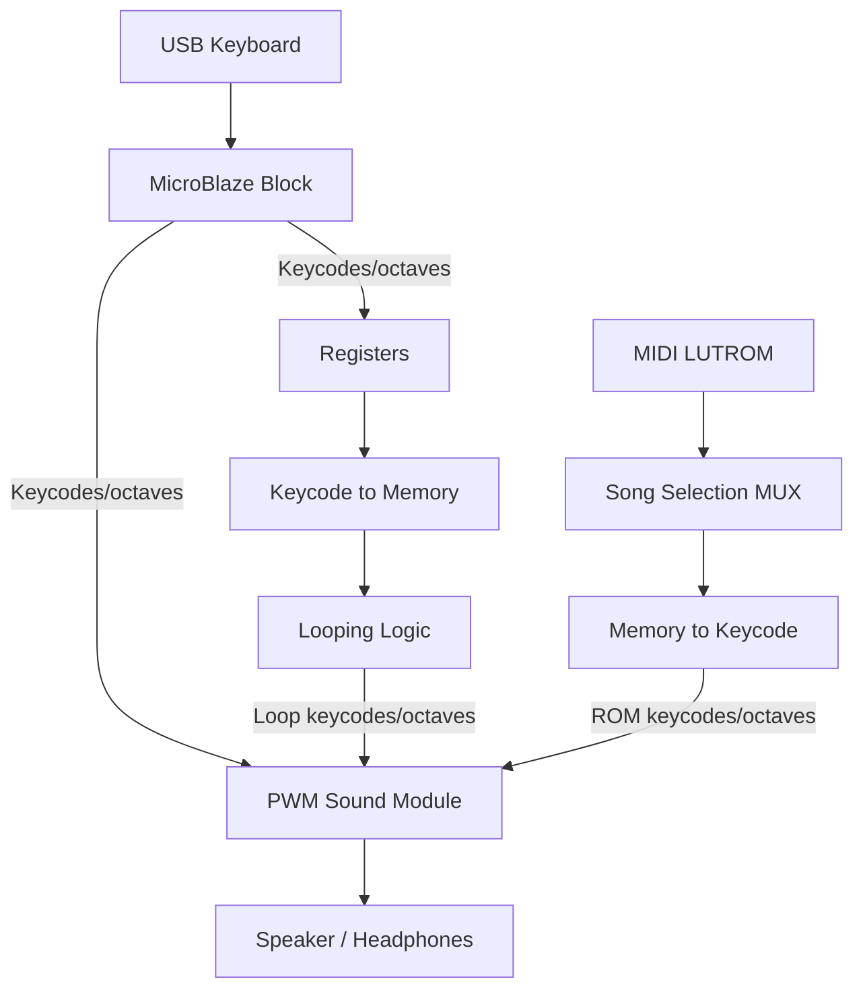
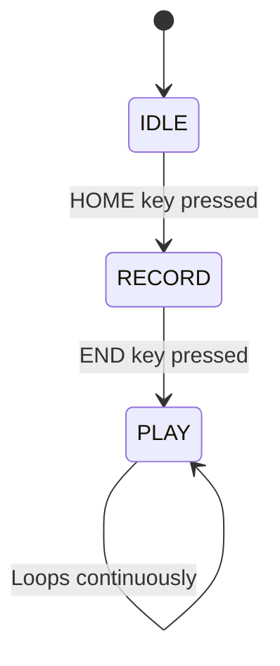

# ECE 385 Final Project — Digital Synthesizer
**Matthew Wu (mzwu3) · Sanjit Sriram (sanjits2)**

A polyphonic digital synthesizer implemented on the Urbana FPGA board. Takes USB keyboard input to play musical notes via 16-voice PWM audio through the board's 3.5mm audio jack, with an on-screen HDMI piano keyboard GUI, a loop recorder, and pre-programmed MIDI song playback.

---

## Features

- **Live keyboard play** with up to 4 simultaneous notes and octave shifting (C1–B7)
- **16-voice polyphonic PWM audio** output through 3.5mm jack
- **Loop recorder** — record a phrase and play it back indefinitely as accompaniment
- **MIDI song playback** — 9 pre-loaded songs (10+ minutes of music stored on-board, no SD card)
- **HDMI GUI** — on-screen piano keyboard that highlights notes as they're played, for all three input modes simultaneously

---

## System Architecture

---

## How It Works

### Live Keyboard Play & Octave Shifting
The keyboard's top two rows (starting at `~` and `Tab`) map to the black and white keys of a piano. At any time, the range spans roughly two octaves. `F1`–`F6` shift the base octave, with `F4` setting `Tab` to middle C (C4). Up to 4 simultaneous notes are supported, limited by the AXI GPIO buffer that MicroBlaze writes keycodes into.

The USB interface is handled by a MAX4231 USB host chip, which communicates via SPI to MicroBlaze, which exposes a 32-bit AXI GPIO buffer that all SV modules scan for keycodes.

### Polyphonic PWM Synthesis
Each pitch is encoded as an `(8-bit keycode, 3-bit octave)` tuple. A 24-entry lookup table stores the half-period for each note in the base octave range (F4–B5). Moving octaves is a simple bit-shift (×2 or ÷2 in frequency), requiring no DSP.

Each of the 16 voices has its own independent square-wave oscillator running off the 100 MHz clock. Voices are mixed by summing their 1-bit outputs into a 5-bit value, then normalized into a PWM duty cycle using a 0–1023 counter (97.7 kHz switch rate). Because all oscillators run synchronously, chords are phase-aligned. Each oscillator costs only ~35 flip-flops and a comparator, making all three playback modes (live, looper, MIDI) simultaneously active with no dropped notes.

### Pre-Recorded MIDI Playback
Pressing `Numpad 1`–`9` plays one of 9 pre-loaded songs. A Python script converts standard MIDI files into a custom `.mem` format:

- Each entry = **30-bit tick delta** (time since last event at 100 MHz) + **88 bits** of 8× `(keycode, octave)` pairs
- The playback state machine waits for the tick count to match, outputs the event's note data, then advances to the next entry
- Loops when the end of ROM is reached; `Numpad Delete` stops playback

This approach is so space-efficient that 10+ minutes of music fits on-board with no SD card.

### Loop Recorder FSM

In **RECORD**, the looper captures 5 signals every clock cycle (`live_oct`, `live_kc0`–`live_kc3`). Whenever any signal changes, it stores the 30-bit delta tick and the new keycode/octave snapshot into registers. In **PLAY**, it replays those snapshots at the same timing, driving `loop_oct` and `loop_kc0`–`loop_kc3` into the PWM module — enabling live overdubs on top of the loop.

Events are stored in registers (not BRAM) for simple combinational reads, at a cost of 64×74 bits total.

### On-Screen Piano GUI (HDMI)
An 84-bit bitmap tracks which of the 88 piano keys are currently active across all input modes. The display is rendered in a layered `always_comb` block:

1. **Background sprite** (loaded from BRAM via COE file)
2. **White keys** — pixels Y=361–479, vertical separator every 13px
3. **Black keys** — ~half the width of white keys, octave pattern repeats every 91px
4. **Key highlights** — active notes lit up in real time

All keyboard geometry is computed arithmetically — zero BRAM used for the piano UI itself.

---

## Design Resources & Statistics

| Resource       | Value       |
|----------------|-------------|
| LUT            | 29,872      |
| DSP            | 7           |
| Memory (BRAM)  | 15.5 blocks |
| Flip-Flop      | 14,506      |
| Frequency      | 47.8 MHz    |
| Static Power   | 0.076 W     |
| Dynamic Power  | 0.421 W     |
| Total Power    | 0.497 W     |
| WNS            | −10.921 ns  |

---

## SV Module Summary

| Module | Description |
|---|---|
| `mb_usb_hdmi_top.sv` | Top-level. Integrates USB input, HDMI output, audio synthesis, ROM player, looper, and hex displays |
| `poly_note_pwm.sv` | 16-voice polyphonic square-wave synthesizer with PWM mixing |
| `looper.sv` | Records and loops up to 4-note keyboard phrases with timing |
| `player.sv` | Reads timed musical events from ROM and drives 8-voice playback |
| `player_rom.sv` | Parameterized ROM storing pre-converted MIDI song events |
| `player_mux.sv` | Selects active song track from 9 sources based on Numpad key press |
| `color_mapper.sv` | Renders piano GUI, key highlights, and background sprite per pixel |
| `vga_controller.sv` | Generates VGA timing signals for 640×480 HDMI output |
| `octave_selector.sv` | Maps F1–F6 key presses to a 3-bit octave value |
| `hex_driver.sv` | Time-multiplexed 7-segment hex display driver for keycode debug |

---

## Tools & Technologies

- **SystemVerilog** — RTL design and simulation
- **Vivado** — synthesis, implementation, block design
- **MicroBlaze** — embedded soft-core processor for USB/SPI handling
- **Python** — MIDI-to-`.mem` converter script
- **Urbana FPGA Board** — Xilinx FPGA with USB host, HDMI, 3.5mm audio jack
